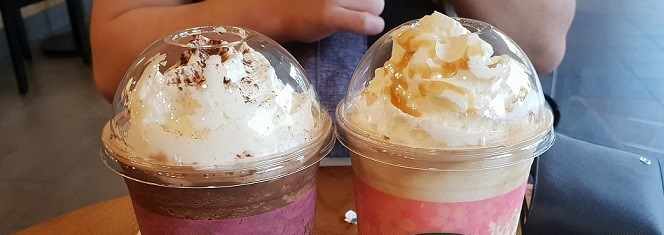
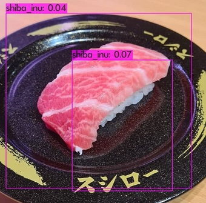

# **For the Love of Food**

---
### Social Media

---
## Content Table
1. Information
2. Objective
---

## 1. Information

My Initial foray into Computer Vision. Documenting the journey

All images used and processed were shot using my own phone
 - Samsung S9+ (Retired)
 - Google Pixel 5a (Current)

---

## 2. Objective

  - Personalized auto-image enhancement on images related to FOOD!!  
  - Images will be posted on Instagram (TBD)
  - Train a Food Detector on  yoloV4
      - Current Implementation - Able to detect Sushi
    

Bonus! Able to detect shiba inu too!

---

## 3. Learning points

### YoloV4 Custom Dataset

  - Every of custom training, the object detection & recognition becomes more accurate (the bounding box
    shown becomes more suppressed and better) (Big duh, with decreasing avg loss)
    
  - Always check the Labels...less end up with a sushi but tagged as a shiba inu  
    
    

